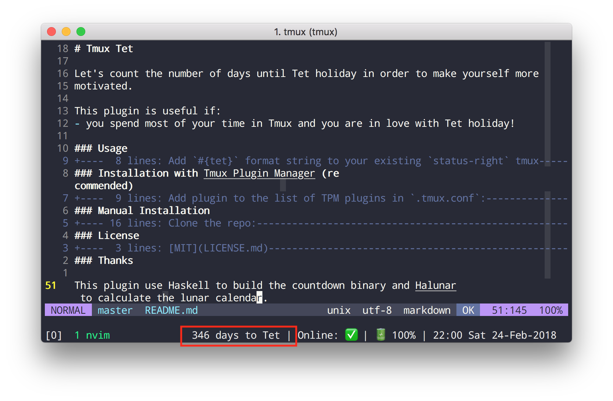

# Tmux Tet

Let's count the number of days until Tet holiday in order to make yourself more
motivated.

This plugin is useful if:
- you spend most of your time in Tmux and you want to view the current lunar date.
- you spend most of your time in Tmux and you are in love with Tet holiday!

### Usage

We have 2 options for showing.

- Add `#{tet}` format string to your existing `status-right` tmux
option to show the countdown number of days to Tet holiday.

- Add `#{lunar_date}` format string to your existing `status-right` tmux
option to show the current lunar date.

Here's the example in `.tmux.conf`:

    set -g status-right "#{tet} | %a %h-%d %H:%M (#{lunar_date})"

### Installation with [Tmux Plugin Manager](https://github.com/tmux-plugins/tpm) (recommended)

Add plugin to the list of TPM plugins in `.tmux.conf`:

    set -g @plugin 'codeaholicguy/tmux-tet'

Hit `prefix + I` to fetch the plugin and source it.

`#{tet}` interpolation should now work.
`#{lunar_date}` interpolation should now work.

### Manual Installation

Clone the repo:

    $ git clone https://github.com/codeaholicguy/tmux-tet ~/clone/path

Add this line to the bottom of `.tmux.conf`:

    run-shell ~/clone/path/tet.tmux

Reload TMUX environment:

    # type this in terminal
    $ tmux source-file ~/.tmux.conf

`#{tet}` interpolation should now work.
`#{lunar_date}` interpolation should now work.

### License

[MIT](LICENSE)

### Thanks

This plugin use Haskell to build the countdown binary and [Halunar](https://github.com/codeaholicguy/halunar) to calculate the lunar calendar.
